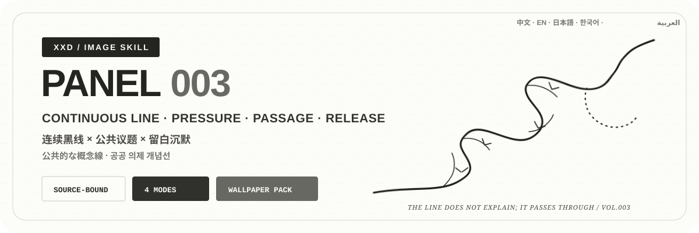

<p align="center">
  
</p>

<div align="center">

# 🦁 XXD Panel 003

### 把照片里的方向、连接、压力与转机压缩成安静而紧张的黑色观念线条

[](./SKILL.md)
[](#四种输出共享同一种手绘逻辑)
[](#边界与信任)

<strong>简体中文</strong> · <a href="README.en.md">English</a> · <a href="README.ja.md">日本語</a> · <a href="README.ko.md">한국어</a> · <a href="README.ar.md">العربية</a>

</div>

> 连续黑线 · 公共议题 · 受力结点 · 留白沉默 · 向外释放

XXD Panel 003 是一个面向 Codex 与兼容 Agent 的图像生成 Skill。它不描摹照片表面，而是锁定主体身份与关系，把源图中的方向、连接、矛盾、压力和转机压缩成一组连续黑色手绘线。线从边缘进入，在低位或侧位盘绕、交错、回折、收紧，再向上或向外释放；原主体的象征轮廓从运动与负形中浮现，却不被完整解释。

画面不复制照片表面，而是从源图事实中找到一个聪明、轻巧、可回看的视觉转化。它融合现代主义编辑插画、包豪斯秩序、绘本温度和时装速写的松弛感；文字像画者顺手留下的克制手写注记，而不是后来贴上去的广告标题。

## 为什么需要 003

普通“极简线条”很容易退化成漂亮但空洞的装饰曲线、机械一笔画，或套用拳头、牢笼、泪滴、铁链等公共议题图标。

003 的顺序完全相反：

```text
锁定源图身份与受力事实 → 规划线条进入、缠绕与收紧 → 让源图轮廓从交叉和负形中显露 → 在转机处向上或向外释放 → 只在真实力点加入结、刺或倒钩 → 让文字缩成线旁的微小痕迹
```

如果换成一张无关照片，线条路线、交叉点、受力点、浮现轮廓和文字仍然成立，这张图就不属于 003。

## 003 的视觉契约

- **源图受力事实：** 至少保留三个身份线索，并分别判断有证据的方向、连接、矛盾、压力和转机，不虚构议题。
- **连续黑线路线：** 线从边缘进入，在偏下、偏侧或靠边处盘绕、交错、回折与收紧，再向上或向外释放。
- **浮现而非描边：** 主体轮廓从线路运动、交叉与负形中显露，可以不闭合，但必须一眼可感知原物。
- **有压力的手工线：** 黑色或近黑细线带轻微粗细变化、摩擦、迟疑、断裂和重新接续，不做光滑贝塞尔曲线。
- **力点标记：** 尖刺、结点、倒钩或短横只放在真实受力、交叉和转向处，不能均匀装饰。
- **留白作为沉默：** 冷白、米白或低饱和浅底占主导，线条系统偏下或偏侧，不居中、不铺满。
- **微型议题文字：** 只保留一个极短主题词或短句，像线条旁的微小痕迹，不成为口号或解释。

## 样张 · 即将补充

项目已预留 [`assets/examples/`](assets/examples/) 样张目录。只有经项目作者确认、确实使用 003 完成的作品才会加入；在此之前不借用其他风格的推文或图片作为占位。

未来样张只用于展示 003 对不同题材的适应力，不会把样张主体、隐喻、配色、文案或画幅变成生成参考或默认值。

## 四种输出共享同一种手绘逻辑

四种模式支持单选或多选。可回复 `1`、`1+3`、`1、2、4` 或 `全部`；Skill 去重后按 1→4 执行。每种模式独立输出并进入独立子文件夹，不制作总图；`全部` 每张原图得到 7 个 PNG（前三种各 1 张＋壁纸 4 张）。尺寸可在同一回复中按模式标注，未标注普通模式按源图适配；文案默认跨所选模式共用，也可按模式单独指定。

| 模式 | 尺寸逻辑 | 成品 |
| --- | --- | --- |
| `top-bottom` | 源图自适应 | 上方完整原图，下方 003 公共议题观念线条；两块都保持原图完整尺寸，严格 50/50 |
| `left-right` | 源图自适应 | 左侧完整原图，右侧 003 公共议题观念线条；两块都保持原图完整尺寸，严格 50/50 |
| `design-only` | 源图自适应 | 只显示变化设计，不显示原照片；沿用原图比例和尺寸 |
| `wallpaper-pack` | 四种设备尺寸 | 分别输出手机、iPad、电脑、儿童手表四张 PNG |

用户精确尺寸 > 指定比例或用途 > 普通模式源图自适应。原始 `003.md` 里的 3:4 只是一开始的创作画幅，不会被写成当前 Skill 的静默默认值。

双联模式的摄影区域保持真实，只允许克制调色和必要的环境扩展。纯设计版与壁纸仍以照片为事实依据，但不显示原片。

### 四端壁纸：连贯或独立

壁纸没有静默尺寸默认。可选择常用预设——手机 `1440×3200`、iPad `2048×2732`、电脑 `3840×2160`、儿童手表 `1024×1024`——也可逐设备自定义。

- **连贯套装（推荐）：** 先生成并验收 iPad 定调图，另外三张都直接参考原照片＋同一张定调图，分别为设备重新构图。
- **四张独立：** 每张只参考原照片，可以探索不同的进入边、低位受力区、交叉路线与释放方向。

连贯不等于裁切。四张壁纸始终分别生成、分别构图、分别验收，也不会按 iPad→手机→电脑→手表顺序垫图造成漂移。

## 文字只能是线条系统里的痕迹

正式生图前，先选择自动文案、自定义文案或无文字。有文字时还要指定目标语言或地区。

自动文案从源图可证实的关系、压力、穿越、转机或释放中提炼一个极短主题词或短句，但不替用户建立公共议题或倡议立场。

默认只有一个标题；只有确有信息价值时才增加零至两条短注释，不会为了显得高级而编造编号、年份、坐标或档案标签。文案仍需通过换图测试。

用户提供最终成稿时逐字保留。用户提供的是方向或可编辑草稿时，才会在保留受众、目的、必备词、语气和潜台词的前提下专业深化。

语言遵循目标受众，而不是用户下指令时使用的语言：

```text
目标市场或受众 > 指定成品语言 > 用户方向语言；都不明确时生图前询问
```

日本版使用自然日语，韩国受众使用自然韩语与正确空格，英国版使用英式英语，阿拉伯语版默认使用自然的现代标准阿拉伯语和真正的从右到左排版。字体也会转译为当地文字系统中自然、略带手写温度的字形，而不是把拉丁字体规则生硬套过去。

## 精确拼版交给代码，作品交给图像生成

图像模型负责源图受力提炼、连续黑线路线、浮现轮廓、摩擦与断裂、真实力点、浅色底留白和微型文字。`scripts/compose_panel.py` 只负责画布规划、精确 50/50 位图拼合、最终尺寸和审计，不会用程序绘图伪造成品。

```bash
python3 scripts/compose_panel.py --plan --layout top-bottom --source photo.png
python3 scripts/compose_panel.py --plan --layout left-right --size 2560x1440
python3 scripts/compose_panel.py --audit result.png --layout design-only --size 2048x2048
```

精确上下画布的总高度必须为偶数，精确左右画布的总宽度必须为偶数。Skill 不会静默修改用户指定的像素。

## 开始使用

```bash
git clone https://github.com/nevertoday/xxd-panel-003.git
mkdir -p ~/.codex/skills
ln -s "$(pwd)/xxd-panel-003" ~/.codex/skills/xxd-panel-003
```

Claude Code 用户可以把同一目录链接到 `~/.claude/skills/xxd-panel-003`。安装后重新启动 Agent 会话。

```text
$xxd-panel-003
把这张照片做成左右双联，文案由你根据照片内涵创作，使用自然韩语。
```

只上传照片也可以调用。Skill 会先用分行编号菜单询问一个或多个模式，再询问文字设置；选择壁纸时还会确认连贯或独立以及设备尺寸。

完整规范：

- [Skill 工作流](SKILL.md)
- [中文完整提示词](references/xxd-panel-003-prompt.zh-CN.md)
- [英文完整提示词](references/xxd-panel-003-prompt.en.md)
- [原始风格提示词](references/003-source.md)

## 边界与信任

- 每张照片只在自己的任务中使用，不借用其他输入、旧成品或样张里的主体、颜色、文案和构图。
- 每次调用都创建新的任务子文件夹；相同原图和参数也要重新生成，旧成品不能冒充当前任务。
- 最终交付为 PNG 位图，不是 SVG、HTML、Canvas 或程序绘图替代品。
- 已配置位图桥接只返回脱敏状态，不显示供应商、端点、请求头、凭据、提示词或服务器响应正文。
- 每个所选普通模式各返回一张；若选择 `wallpaper-pack`，再返回四张独立壁纸。选择 `全部` 时每张原图共返回 7 个 PNG，分处四个同级模式文件夹，绝不生成拼贴总览。

本地拼版需要 Python 3 和 Pillow。安全位图桥接使用 Python 3.11+ 的 `tomllib`。图像生成仍需要主机 Agent 的内置位图能力或已经配置好的兼容位图路径。

## 项目结构

```text
xxd-panel-003/
├── SKILL.md
├── README.md / README.en.md / README.ja.md / README.ko.md / README.ar.md
├── agents/openai.yaml
├── assets/
│   ├── banner.svg
│   └── examples/（未来本地样张占位）
├── scripts/
│   ├── compose_panel.py
│   └── configured_imagegen.py
└── references/
    ├── xxd-panel-003-prompt.zh-CN.md
    ├── xxd-panel-003-prompt.en.md
    └── 003-source.md
```

## 关于 XXD

XXD 是小小东的品牌名称缩写。项目由 [@xiaoxiaodong01](https://x.com/xiaoxiaodong01) 创建并维护。

## 服务与会员

### 深度咨询 · 299 元/小时

Skills 使用的一对一深度咨询按 299 元/小时收费。请通过下方微信二维码联系小小东预约。

### 小小东 Skills 用户交流群 · 入群 99 元

一次支付 99 元加入用户交流群，用于交流工作流、作品与互助；不包含按小时的一对一深度咨询。扫码后请备注“Skills 用户交流群”。

### 知识星球＋成员提示词库 · 699 元/年

[知识星球](https://wx.zsxq.com/group/15554814142882)与[小小东成员提示词库](https://vip.xiaoxiaodong.ai/)是同一份会员权益：**一次年费同时开通两边，无需重复付费。**

1. 在[知识星球](https://wx.zsxq.com/group/15554814142882)开通后，微信联系小小东领取成员提示词库兑换码。
2. 在[成员提示词库](https://vip.xiaoxiaodong.ai/)自助开通后，微信联系小小东邀请进入知识星球。

<p align="center">
  <a href="https://xiaoxiaodong.pages.dev/assets/wechat-qr.png"></a>
</p>

<div align="center">

**不替照片喊口号，只让那根线把压力、穿越与释放留下来。**

</div>

---

<div align="center">
  <h2>☕ 为开源项目赞助算力</h2>
  <p>如果这个项目为你节省了时间，可以通过微信或支付宝赞助后续测试与生成算力。</p>
  <table>
    <tr>
      <td align="center" width="240">
        <a href="https://colors.xiaoxiaodong.ai/docs/images/wechat-reward-qr.png"></a><br>
        <strong>微信算力赞助</strong>
      </td>
      <td align="center" width="240">
        <a href="https://colors.xiaoxiaodong.ai/docs/images/alipay-reward-qr.png"></a><br>
        <strong>支付宝算力赞助</strong>
      </td>
    </tr>
  </table>
  <p><sub>赞助完全自愿，不会改变这个开源项目的使用权限。</sub></p>
</div>
